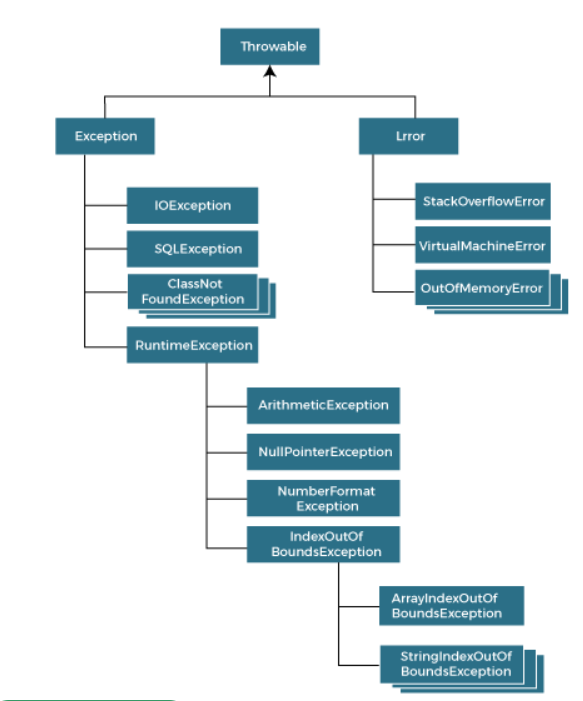

# learn-java
A repository for java learning path

# Exception Handling

Exception handling is the mechanism to solve the runtime errors so that normal flow of the application can be maintained.

**Exception** stands for abnormal condition.
<fig>

<figcaption align="center"><b>Fig.1 Hierarchy of Java Exception class.</b></figcaption>
</fig>